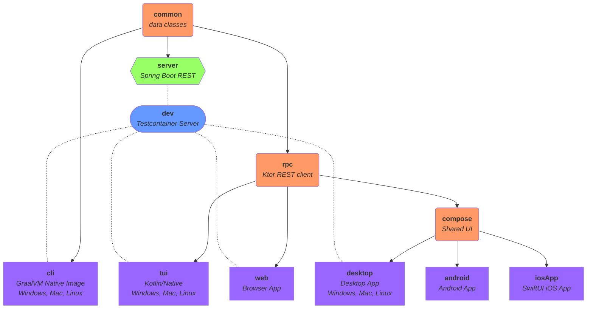

# Kotlin Bars

<!-- [](https://deploy.cloud.run) -->

This sample uses Kotlin Multiplatform for a data-oriented application sharing as much code as possible across: API server, web app, Android app, iPhone app, desktop app, and a CLI.  Releases are automated using GitHub Actions, deploying server pieces on Google Cloud and client binaries to GitHub and TestFlight.




## API Server

Run the api server:
```
./gradlew :server:bootRun
```

Create a bar:
```
curl -X POST http://localhost:8080/api/bars \
   -H 'Content-Type: application/json' \
   -d '{"name": "Test"}'
```

Fetch the bars: [localhost:8080/api/bars](http://localhost:8080/api/bars)

### Prod-Like

Start Postgres manually:
```
docker run --rm -ePOSTGRES_PASSWORD=password -p5432:5432 --name my-postgres postgres:13.3
```

Create a native exec (with GraalVM installed / in PATH):
```
./gradlew :server:nativeCompile

SPRING_R2DBC_URL=r2dbc:postgresql://localhost/postgres \
  SPRING_R2DBC_USERNAME=postgres \
  SPRING_R2DBC_PASSWORD=password \
  server/build/native/nativeCompile/server
```

Create container:
```
./gradlew :server:bootBuildImage
```

Start the server:
```
docker run -it --network host \
  -eSPRING_R2DBC_URL=r2dbc:postgresql://localhost/postgres \
  -eSPRING_R2DBC_USERNAME=postgres \
  -eSPRING_R2DBC_PASSWORD=password \
  kotlin-bars-server
```

## Web Server

Run the web asset server:
```
./gradlew -t :web:jsBrowserRun
```


## Android Client

*NOTE: You must use JDK 11 or higher*

Start the server:

  ```sh
  ./gradlew :server:bootRun
  ```

Run the client:

1. [Download Android Command Line Tools](https://developer.android.com/studio)

1. Install the SDK:

    ```sh
    mkdir android-sdk
    cd android-sdk
    unzip PATH_TO_SDK_ZIP/sdk-tools-linux-VERSION.zip
    mv cmdline-tools latest
    mkdir cmdline-tools
    mv latest cmdline-tools
    cmdline-tools/latest/bin/sdkmanager --update
    cmdline-tools/latest/bin/sdkmanager "platforms;android-31" "build-tools;31.0.0" "extras;google;m2repository" "extras;android;m2repository"
    cmdline-tools/latest/bin/sdkmanager --licenses
    ```

1. Set an env var pointing to the `android-sdk`

    ```sh
    export ANDROID_SDK_ROOT=PATH_TO_SDK/android-sdk
    echo "sdk.dir=$(realpath $ANDROID_SDK_ROOT)" > local.properties
    ```

1. Run the build from this project's dir:

    ```sh
    ./gradlew :android:build
    ```

1. You can either run on an emulator or a physical device and you can either
   connect to the server running on your local machine, or connect to a server
   you deployed on the cloud.

   * Emulator + Local Server:

      * From the command line:

        ```sh
        ./gradlew :android:installDebug
        ```

      * From Android Studio / IntelliJ, navigate to
        `android/src/main/kotlin/kotlinbars/android` and right-click on
        `MainActivity` and select `Run`.

   * Physical Device + Local Server:

      * From the command line:

         1. [Setup adb](https://developer.android.com/studio/run/device)
         1. `./gradlew :android:installDebug -PbarsUrl=http://YOUR_MACHINE_IP:8080/`

      * From Android Studio / IntelliJ:

         1. Create a `local.properties` file in your root project directory containing:

             ```sh
             barsUrl=http://YOUR_MACHINE_IP:8080/
             ```

         1. Navigate to `android/src/main/kotlin/kotlinbars/android` and right-click on `MainActivity` and select `Run`.

   * Emulator or Physical Device + Cloud:

      * From the command line:

         1. [setup adb](https://developer.android.com/studio/run/device)
         1. `./gradlew :android:installDebug -PbarsUrl=https://YOUR_SERVER/api/bars`

      * From Android Studio / IntelliJ:

         1. Create a `local.properties` file in your root project directory containing:

             ```sh
             barsUrl=https://YOUR_SERVER/api/bars
             ```

         1. Navigate to `android/src/main/kotlin/kotlinbars/android` and right-click on `MainActivity` and select `Run`.


## iOS Client

Open `iosApp/Kotlin_Bars.xcodeproj` in XCode.

You will need a "bars" API server for the app to connect to so, start the server:
```
./gradlew :server:bootRun
```

If you run in an emulator, the app will connect by default to `localhost` so no additional configuration is needed.  For running on a physical device you need to set the following in your `local.properties` file:
```
barsUrl=http://YOUR_IP:8080/api/bars
```


## Desktop Client

Run, connecting to the default `http://localhost:8080/api/bars` url (if `barsUrl` is not set in the `local.properties` file):
```
./gradlew :desktop:run
```

Run, connecting to the specified url:
```
./gradlew :desktop:run -PbarsUrl=http://YOUR_URL:8080/api/bars
```

Start a server with Testcontainers and connect to it:
```
./gradlew :desktop:dev
```

Package a native app and run it:
*Note: Requires JDK 15+*
```
./gradlew :desktop:runDistributable
```

Package a native app (for the current platform):
*Note: Requires JDK 15+*
```
./gradlew :desktop:package
```


## CLI Client

Run, connecting to the default `http://localhost:8080/api/bars` url (if `barsUrl` is not set in the `local.properties` file):
```
./gradlew :cli:run -q --console=plain
```

Run, connecting to the specified url:
```
./gradlew :cli:run -q --console=plain -PbarsUrl=http://YOUR_URL:8080/api/bars
```

Start a server with Testcontainers and connect to it:
```
./gradlew :cli:dev -q --console=plain
```

Build the native image executable:
```
./gradlew :cli:nativeImage
```

Run it:
```
cli/build/graal/kotlin-bars
```


## TUI Client

The Terminal User Interface will eventually be a rich / interactive CLI for Kotlin Bars but today is just a basic CLI.

Run, connecting to the default `http://localhost:8080/api/bars`:
```
./gradlew :tui:linkDebugExecutable && tui/build/bin/linuxX64/debugExecutable/tui.kexe
```

Run, connecting to the specified url:
```
./gradlew :tui:linkDebugExecutable -PbarsUrl=http://YOUR_URL:8080/api/bars && tui/build/bin/linuxX64/debugExecutable/tui.kexe
```


## GitHub Actions

```
export PROJECT_ID=YOUR_GCP_PROJECT
```

Enable APIs via gcloud:
```
gcloud services enable \
  servicenetworking.googleapis.com \
  sqladmin.googleapis.com \
  vpcaccess.googleapis.com \
  run.googleapis.com \
  containerregistry.googleapis.com \
  --project=$PROJECT_ID
```

Create a Service Account:
```
gcloud iam service-accounts create kotlin-bars-gha --project=$PROJECT_ID

export SA_EMAIL="kotlin-bars-gha@$PROJECT_ID.iam.gserviceaccount.com"

gcloud projects add-iam-policy-binding $PROJECT_ID \
  --member=serviceAccount:$SA_EMAIL \
  --role=roles/container.admin

gcloud projects add-iam-policy-binding $PROJECT_ID \
  --member=serviceAccount:$SA_EMAIL \
  --role=roles/storage.admin

gcloud projects add-iam-policy-binding $PROJECT_ID \
  --member=serviceAccount:$SA_EMAIL \
  --role=roles/run.admin

gcloud projects add-iam-policy-binding $PROJECT_ID \
  --member=serviceAccount:$SA_EMAIL \
  --role=roles/compute.networkAdmin

gcloud projects add-iam-policy-binding $PROJECT_ID \
  --member=serviceAccount:$SA_EMAIL \
  --role=roles/compute.loadBalancerAdmin

gcloud projects add-iam-policy-binding $PROJECT_ID \
  --member=serviceAccount:$SA_EMAIL \
  --role=roles/compute.instanceAdmin.v1

gcloud projects add-iam-policy-binding $PROJECT_ID \
  --member=serviceAccount:$SA_EMAIL \
  --role=roles/cloudsql.admin

gcloud projects add-iam-policy-binding $PROJECT_ID \
  --member=serviceAccount:$SA_EMAIL \
  --role=roles/iam.serviceAccountUser

gcloud projects add-iam-policy-binding $PROJECT_ID \
  --member=serviceAccount:$SA_EMAIL \
  --role=roles/iam.serviceAccountAdmin

gcloud projects add-iam-policy-binding $PROJECT_ID \
  --member=serviceAccount:$SA_EMAIL \
  --role=roles/vpcaccess.admin

gcloud projects add-iam-policy-binding $PROJECT_ID \
  --member=serviceAccount:$SA_EMAIL \
  --role=roles/iam.securityAdmin
```

Create a key for the service account:
```
gcloud iam service-accounts keys create /dev/stdout \
  --iam-account=$SA_EMAIL \
  --project=$PROJECT_ID 2>/dev/null
```

Copy the JSON key from STDOUT and use it as the value of `GCP_CREDENTIALS` in the next step.

Create GitHub secrets for:
- `GCP_PROJECT`
- `GCP_REGION`
- `GCP_CREDENTIALS`
- `DOMAINS`

Your `DOMAINS` then need to be mapped to the IP listed in the output of the `cloud` GitHub Action.

### iOS / Mac Signing


Tag a release to trigger the CLI, Android, and Desktop release builds.


### Testing GitHub Actions:
```
git tag -d v1.0.0; git push --delete origin v1.0.0; git commit -a --allow-empty-message --no-edit; git tag v1.0.0; git push; git push origin v1.0.0
```
